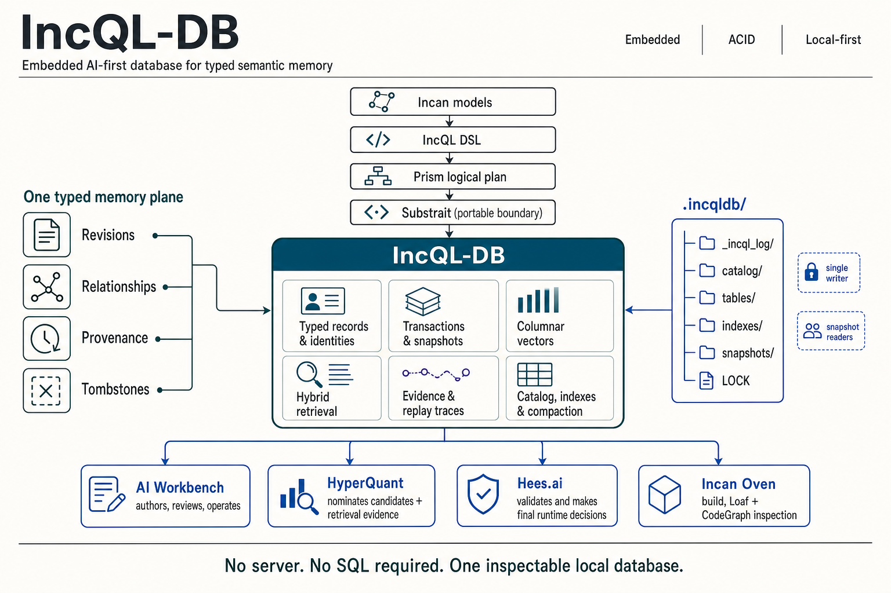

# IncQL RFC 067: Typed semantic memory store

- **Status:** Draft
- **Created:** 2026-07-30
- **Author(s):** Danny Meijer (@dannymeijer)
- **Related:**
  - IncQL RFC 028 (semantic identity and target model)
  - IncQL RFC 029 (typed metadata attachments)
  - IncQL RFC 030 (Prism lineage graph)
  - IncQL RFC 036 (plan bundle)
  - IncQL RFC 043 (canonical equality and digest profiles)
  - IncQL RFC 047 (semantic evidence graph and agent query surface)
  - IncQL RFC 060 (incremental transformation and temporal history semantics)
  - IncQL RFC 061 (asset interfaces, contracts, access, ownership, versions, and deprecation)
  - IncQL RFC 062 (project build lifecycle, selectors, state, artifacts, and delegated execution)
- **Issue:** —
- **RFC PR:** [IncQL #108](https://github.com/encero-systems/IncQL/pull/108)
- **Written against:** IncQL 0.1.0 / Incan v0.5-era IncQL
- **Shipped in:** —

## Summary

This RFC defines the logical record contract for IncQL-DB: a local typed semantic memory store for durable facts, revisions, relationships, source and artifact references, retrieval traces, decisions, receipts, and bounded snapshots. The store preserves the identity and evidence needed to explain a result, but it does not invent domain decisions, policy outcomes, model output, or physical storage behavior. Record families remain rooted in validated Incan models; IncQL remains the query and materialization layer.

## Core model

The following non-normative overview shows the intended responsibility boundary. It is an orientation aid; the normative contract is defined by the terms and requirements in this RFC.



### Record-family hierarchy

The primary hierarchy is record family, logical record, then immutable revision. A family defines the typed domain and schema-evolution contract; a logical record identifies one durable subject in that family; each revision captures one committed state of that subject. Relationships, bindings, activities, decisions, and receipts refer to those identities and revisions rather than replacing this hierarchy.

```text
record family
  schema identity + evolution identity
  |
  +-- logical record
        stable identity for one subject
        |
        +-- revision 1  immutable committed state
        +-- revision 2  immutable successor state
        +-- revision N  immutable successor state
```

1. A **record family** is a named, typed category of stored records with an Incan-model-derived schema and an explicit evolution identity.
2. A **logical record** is the durable subject within one record family. Its logical identity remains stable while its state evolves through revisions.
3. A **record revision** is one immutable committed representation of a logical record, with a schema identity, structural content digest, provenance, lifecycle state, and optional payload references.
4. A **semantic handle** is a readable, typed reference that may resolve to one logical record, no record, or an explicit ambiguity result. It is not a substitute for durable identity.
5. A **relationship record** is a typed, directed fact between concrete record revisions or logical records. It preserves its source, basis, scope, and validity rather than flattening every link to an unqualified dependency.
6. A **binding** pins an exact revision into another revision, such as a released artifact, reviewed record set, execution input, or inspected build result. A binding must never silently follow a later current revision.
7. An **activity record** captures one process such as extraction, review, retrieval, verification, compilation, or publication. A **decision record** captures the result of a designated evaluator that considered such activity. The store records both; it does not become that evaluator.
8. A **receipt** is a redacted, integrity-bound projection of a decision or completed activity. It names the relevant records and snapshot without requiring readers to reconstruct the decision history from logs.
9. A **snapshot** is an immutable, named view of the record revisions and relationship revisions visible to a read or activity. Every bounded query result, trace, receipt, and successor write must be attributable to a snapshot.

## Motivation

Local AI systems and developer tools accumulate information that needs more than a document store or vector index. A source may be ingested, reviewed, rejected, superseded, approved for one package revision, selected by a retriever, evaluated by a designated process, and later retained only as a redacted provenance reference. A compiler-derived fact may be connected to a source declaration, diagnostic, test, build artifact, compatibility result, and replacement artifact. These are all typed records with identity, relationships, revisions, and lifecycle.

Treating this material as JSON files, loose tables, model prompts, or transient logs creates recurring failures. A later reader cannot tell which revision was selected, whether a candidate was evaluated or merely absent, whether a package pinned reviewed material or followed a mutable latest version, whether a receipt reflects a real decision, or what became of a removed payload. Rebuilding the answer from operational logs is both expensive and unsafe.

Existing IncQL RFCs define relational plans, semantic targets, metadata attachments, graph projections, evidence, assets, lifecycle state, and temporal history. They do not define the local durable record substrate that lets those concepts become shared system memory without giving every product its own incompatible store.

## Goals

- Define typed record families, logical records, immutable revisions, semantic handles, typed relationships, bindings, snapshots, activity records, decision records, retrieval traces, and receipts.
- Require stable logical identity to remain distinct from physical encoding, display labels, file locations, and serializer output.
- Preserve the lifecycle from source or artifact revision through candidate, review, decision, selection, release, inspection, supersession, retention, and tombstoning.
- Make candidate, reviewed, active, rejected, superseded, and released state explicit and attributable to a decision rather than a mutable application flag.
- Make package, artifact, and execution inputs pin exact referenced revisions.
- Make retrieval trace retention first-class, including candidate-generation scope, screening outcomes, selected candidates, rejected candidates, and replay identity.
- Support graph traversal and tabular materialization over the same records without duplicating decision-relevant facts.
- Require bounded reads and snapshot identity for inspection, agent tooling, replay, and audit.
- Preserve redaction, retention, and access-relevant state without making the store the policy author or decision-maker.
- Leave physical layout, transaction protocol, index algorithms, query syntax, and product-specific schemas to focused follow-up RFCs.

## Non-Goals

- Defining a general document database, graph database, vector database, SQL dialect, or hosted database service.
- Defining a complete storage engine, segment format, write-ahead log, locking protocol, compaction algorithm, encryption scheme, or recovery implementation.
- Defining vector encoding, approximate-nearest-neighbour behavior, embedding generation, ranking, or retrieval-policy semantics.
- Defining content review policy, package validation, authorization, model behavior, prompt construction, or user-interface workflows.
- Replacing RFC 028 plan-local semantic targets with global store identities.
- Defining temporal query syntax or the transformation-history semantics owned by RFC 060.
- Requiring every IncQL application to use IncQL-DB.

## Guide-level explanation

An author should think of IncQL-DB as the durable memory of a typed system, not as a place to put arbitrary JSON. The system first stores a source or artifact revision, then records the candidate or derived fact it produced, the review or validation activity, the resulting decision, and any binding that makes the revision part of a released or executable artifact.

```text
source A revision  ----derives---->  candidate revision  ----evaluated by---->  review activity
                                         ^                                          |
source B revision  ----supports--------+                                          v
                                                                            decision record
                                                                                  |
                                                                                  v
                                              binding  --------pins------->  artifact revision
                                                                                  ^
                                                                                  |
build input        ----input to---->  build activity  ----produces-----------+
```

This is a directed acyclic evidence graph, not a linear workflow. A source can support multiple candidates, one candidate can be evaluated by several activities, and an artifact can bind multiple exact revisions. The store retains the typed edges between these records. It does not infer that an approved source automatically applies to every artifact, that a high-scoring retrieval candidate passed screening, or that a stored proposal was accepted. Those are explicit relationship, decision, and binding records.

The following model shapes are illustrative. They show the distinction between identity, revision, payload, and evidence; they do not introduce a new authoring syntax in this RFC.

```incan
model SourceRevision:
    source_id: str
    revision: int
    content_digest: str
    review_state: str
    rights_state: str

model KnowledgeRevision:
    knowledge_id: str
    revision: int
    source_revision: str
    content_digest: str
    lifecycle_state: str

model SelectionTrace:
    trace_id: str
    snapshot_id: str
    candidate_generator: str
    selected_revisions: list[str]
    rejected_revisions: list[str]
    replay_fingerprint: str
```

A release or execution artifact binds concrete record revisions rather than a mutable name such as "latest reviewed record." A later source correction produces a successor revision and a visible impact question: which bindings, traces, receipts, or artifacts used the earlier revision?

## Reference-level explanation

### Record families and schema identity

Every stored logical record must belong to exactly one record family. A record family must have a stable family identifier, an Incan-model-derived schema identity, and an explicit schema-evolution identity. A store must reject a record revision that cannot be decoded as the declared family schema or a declared compatible evolution of that schema.

A record family may represent sources, reviewed facts, package declarations, policies, activities, decisions, artifacts, code facts, diagnostics, tests, retrieval traces, receipts, or another typed system concern. A family must not use an unbounded document blob as its canonical state. Opaque payloads may be referenced by a typed record revision when their bytes are not the logical record state.

Extensions to a record family must use typed metadata or a declared successor schema. Implementations must not make undeclared JSON members, storage-specific columns, or file paths silently authoritative.

### Logical identity and revisions

Every record revision must identify its record family, logical record, revision, schema identity, structural content digest, provenance kind, and lifecycle state. The logical-record identity must remain stable across revisions that represent the same subject. A revision identity must identify one immutable committed state of that subject.

Logical identity must not be derived solely from display text, JSON serialization bytes, physical path, insertion order, or backend-generated row identity. A structural identity profile may derive identity from validated family fields, a declared stable external identifier, or another family-defined rule. The profile must be explicit and inspectable.

Once committed, a record revision must not change. A correction, review change, replacement, approval change, access change, or retention change must create a successor revision or a separately typed decision record. Implementations may compact physical bytes, but compaction must not alter the logical identity or visible content of retained revisions.

### Identity scope and cross-store transfer

Logical identity is stable within its declared record family in one store. This RFC does not define global identity, federation, cross-store equivalence, collision resolution, or merge semantics. An export must identify its origin store, record family, logical-record identity, revision identity, selected snapshot, and identity profile. An import must create an explicit imported revision and retain that origin as provenance. It must not claim that an imported record is the same logical record as an existing local record solely because a handle, payload digest, or display value matches.

A later interoperability RFC may define portable identity profiles and explicit equivalence or merge claims. Until then, cross-store identity is an inspectable provenance question, not an implicit store operation.

### Candidate, review, active, and released state

A candidate revision is a proposed record state, not an approved replacement for an existing record. Its origin, input snapshot, and provenance must remain inspectable even when it is later rejected. Review or validation activity may produce a decision record that approves, rejects, requests revision of, or otherwise classifies a candidate.

An active or released selection must be represented by a decision and a binding to exact record revisions. An implementation must not turn a candidate into active or released state by overwriting a mutable flag, redirecting an unqualified handle, or changing a current-record pointer without a successor snapshot. A later replacement must record its predecessor, the supersession basis, and its impact on bindings that selected the earlier revision.

### Semantic handles

A semantic handle is a readable typed reference used by authoring, import, review, and inspection surfaces. Handle resolution must return one of `resolved`, `unresolved`, or `ambiguous`. A store must not select an arbitrary target for an ambiguous handle.

Resolved handles must record the logical-record identity and revision or snapshot through which resolution occurred. A handle may be retained as provenance for an unresolved proposal. It must not become a canonical identity merely because a later resolver happened to select a record with matching text.

### Payloads, retention, and tombstones

Typed record revisions may reference source text, vectors, source spans, binary artifacts, column segments, index files, generated outputs, or other payloads. Payload identity and retention state must be explicit. A record revision must remain distinguishable from its physical payload reference.

When policy permits or requires payload removal, the store must retain a tombstone or retention revision that records the reason, time, affected payload identity, and permitted residual provenance. It must not silently make a removed payload appear as an unknown or never-existing record. A tombstoned payload must not become readable through an older snapshot unless the governing retention contract explicitly permits it.

### Provenance anchors

When a record revision derives from an addressable source or artifact, it must retain the available source revision, content fingerprint, and a typed anchor such as a source span, artifact member, record key, or other declared coordinate. It must also retain review, rights, and retention references where those classifications govern later use. The store may redact an anchor or payload under its declared retention contract, but it must retain enough typed provenance to distinguish a redacted dependency from an absent one.

### Relationships and bindings

A relationship record must identify its relation kind, source and target identities, source basis, scope, and validity or observation state. Relation kinds may include derived-from, supports, reviewed-by, rejected-by, selected-for, supersedes, contains, pins, produced, verified-by, built-from, compatible-with, and projected-from. A relation must not be flattened to a generic dependency if doing so would lose its basis or decision context.

A binding must name exact source and target record revisions. A released, executable, or inspected artifact must pin every decision-relevant source, record, policy, activity, payload, or artifact revision on which it depends. An implementation must not resolve a binding to a later current revision unless a successor artifact revision explicitly records that replacement.

### Activities, decisions, and receipts

An activity record must identify its activity kind, input snapshot, input record revisions, configuration or profile identity, output record revisions, actor or executor identity where available, and outcome. Activities may represent extraction, review, retrieval, verification, build, publication, or another bounded process.

A decision record must identify the decision kind, decision owner, input snapshot, evaluated record revisions, result, reason namespace, reason, and any structural diagnostic safe to retain. A store may persist a decision record only when a designated evaluator or verified adapter supplies it. The store must not infer an approval, acceptance, publication, compatibility, or policy result from record shape or retrieval rank.

A receipt must bind a completed activity or decision, its relevant revisions and snapshot, and the digest of any visible result or materialization through a canonical identity. A receipt must be redacted according to its declared audience. A receipt must distinguish an accepted or successful result from a rejected or failed result and must not expose accepted-only content in the latter case.

### Retrieval traces

A retrieval trace is an activity record with additional candidate evidence. It must identify the input snapshot, corpus or collection revisions, retrieval profile, vectorizer and codec identities when applicable, candidate generator, candidate-generation bound, screening-context identity, and replay fingerprint.

For every retained candidate, the trace must record the candidate revision, score or ordering evidence when available, candidate rank, screening result, selection result, and explicit rejection reasons where rejected. The trace must distinguish candidates that were evaluated and rejected from records that were not returned by the candidate generator. It must not represent a candidate-generation limit, index coverage gap, unavailable payload, or unsupported profile as a policy rejection.

A consumer may use only the trace entries whose recorded screening and selection state permits that use. A retrieval trace itself must not make a candidate usable. Exact or full-precision retrieval may be retained as a correctness and replay baseline even when a compressed or approximate profile produced the runtime candidate set.

### Snapshots and bounded reads

Every committed write set must publish a successor snapshot only after all of its record revisions, relationships, bindings, activity outputs, and required receipts are visible together. A failed or incomplete write set must not produce a visible successor snapshot.

A bounded read, graph traversal, tabular materialization, retrieval trace, decision, receipt, export, or inspection artifact must identify the snapshot on which it operated. A reader may request a named snapshot or the active snapshot. If the requested snapshot is unavailable because retention or access policy removed required state, the store must return an explicit unavailable or access-denied result rather than silently substituting newer data.

Every query surface must declare or enforce a bound over records, depth, bytes, time, or another materialization limit. An agent-facing inspection surface must return evidence references and snapshot identity with its result; it must not present an unbounded scan as a complete answer.

### Access and lifecycle classification

Record revisions, payloads, relationships, and receipts may carry explicit visibility, rights, retention, review, decision, and lifecycle classifications. The store must preserve these classifications and make denied or unavailable state distinguishable from absent state when disclosure of existence is permitted.

This RFC does not define a policy language or authorization engine. The store must evaluate only the access and retention rules that a later storage or policy RFC explicitly delegates to it. It must preserve the decision input and decision result needed to inspect the outcome.

## Design details

### Syntax

This RFC introduces no new IncQL authoring syntax. Incan models remain the way authors declare record-family shapes. IncQL dataset and query surfaces may later gain typed store accessors, but they must lower to the record, revision, relationship, binding, and snapshot semantics defined here.

### Semantics

The logical store is the owner of durable record identity, revision visibility, relationship preservation, and snapshot consistency. It is not the owner of the meaning of a policy, the truth of a source, the outcome of a domain decision, or the content of an untrusted model proposal.

The same record set may project to typed tables, graph traversals, package manifests, retrieval indexes, inspection artifacts, or receipts. Those projections must retain the underlying record and snapshot references. A projection must not create a second authoritative copy of a record merely for convenience.

### Interaction with existing IncQL surfaces

RFC 028 semantic targets remain scoped to IncQL plans, profiles, and execution evidence. A store record may reference an RFC 028 target, but a plan-local target does not become a global store identity without an explicit binding.

RFC 029 metadata attachments may annotate record revisions and relationships, but metadata must not replace the typed record-family contract.

RFC 030 and RFC 047 graph projections may traverse store relationships. They must preserve relation kinds, basis, revision references, and snapshot identity rather than treating a graph edge as timeless truth.

An active Prism authored store may remain process-local and in memory. This RFC does not require every Prism cursor, plan node, rewrite view, or source row considered by a plan to become an IncQL-DB record. When an implementation retains a Prism plan, lineage view, inspection artifact, or execution evidence in IncQL-DB, it must represent the retained material through the record, revision, relationship, binding, and snapshot semantics defined here. Persisting planning metadata must not imply that IncQL-DB owns or copies the physical rows of an external source.

RFC 036 bundles and RFC 061 assets may use bindings to pin concrete store revisions. A bundle or asset must not use an unqualified current-record lookup for decision-relevant inputs.

RFC 043 canonical equality and digest profiles define reusable canonicalization principles. This RFC requires the selected identity and receipt profile to be recorded; it does not select one universal digest scheme.

RFC 060 temporal history remains distinct from record revision. A record revision explains how stored system state changed. Temporal history explains the valid and observation time of facts represented by an asset or transformation.

RFC 062 build and lifecycle state may be stored as typed records, activities, relationships, bindings, and receipts. This RFC does not alter build selection, execution, or publication decisions.

### Compatibility and migration

This RFC is additive. Existing IncQL plans, datasets, assets, bundles, and inspection artifacts remain valid without IncQL-DB-backed records.

An implementation may import a legacy file, table, or document into a record family only by assigning an explicit source identity, schema identity, provenance kind, and imported revision. It must not claim that historical revisions, decisions, or receipts existed when the imported material lacks that evidence.

Schema evolution, identity-profile migration, payload relocation, compaction, and retention migration must create an explicit successor snapshot and retain the compatibility or migration evidence needed to explain the change.

## Alternatives considered

- **Use JSON documents as the logical store.** Rejected because serializer bytes, optional fields, document paths, and untyped mutation make structural identity, evolution, and decision boundaries fragile.
- **Use only relational tables.** Rejected because tables alone do not define semantic handles, revision pinning, typed relationships, payload lifecycle, or activity and receipt semantics. Tables remain an important projection and physical implementation option.
- **Use only a property graph database.** Rejected because graph traversal is one access mode, not the decision model. Typed record families, revisions, payloads, and bounded materialization must exist even when no graph engine is loaded.
- **Use a vector database as system memory.** Rejected because vector similarity cannot encode review state, package pinning, decision provenance, retention, or receipt identity. Vectors are retrieval payloads and candidate hints.
- **Keep lifecycle information in application-specific logs.** Rejected because it prevents shared inspection, reproducibility, and impact analysis across packages, retrieval, execution, and artifact consumers.
- **Make the store decide policy.** Rejected because storage must preserve and enforce declared boundaries without replacing the evaluator that owns those decisions.

## Drawbacks

- Typed records, revisions, relationships, traces, and receipts add up-front modelling work compared with storing a document and a vector.
- Identity and schema-evolution discipline makes imports and migrations more explicit.
- Retaining rejected candidates and predecessor revisions consumes storage and requires retention policy.
- Snapshot-bound reads can expose unavailable historical state that callers must handle explicitly.
- The logical model establishes a substantial contract before the physical database engine exists.

## Implementation architecture

This section is non-normative. A practical first implementation can use a directory-backed local store with a catalog, append-oriented commit records, immutable payload segments where appropriate, and a single-writer/multiple-snapshot-reader model. The implementation should make typed record families and snapshot publication work before adding large-scale vector indexing or broad physical operator coverage.

The first durable test corpus should include both reviewed information records and engineering records. It should prove that one store can follow a source or artifact revision through candidate creation, review or validation, decision, active or released binding, retrieval or inspection, receipt, supersession, and tombstoning without collapsing those stages into undocumented application state. It should also prove that a rejected candidate cannot appear as an active binding, that a retrieval trace names its exact selected revisions and candidate-generation bound, and that a removed payload remains visibly tombstoned rather than silently disappearing.

## Layers affected

- **Incan models and IncQL library package:** record-family declarations, typed record references, bounded store accessors, and diagnostics for incompatible family or revision use.
- **IncQL planning and execution:** typed store reads, snapshot binding, relationship traversal, tabular materialization, and trace/receipt projection boundaries.
- **IncQL-DB runtime:** catalog, revision visibility, semantic-handle resolution, binding validation, snapshot publication, retention state, and typed inspection results.
- **Storage and recovery:** later transaction, segment, index, compaction, and recovery work must preserve the logical record and snapshot guarantees in this RFC.
- **Retrieval providers and decision runtimes:** retrieval traces, candidate screening outcomes, selected references, decisions, and receipts must remain typed records rather than private logs.
- **CLI and inspection tooling:** bounded snapshot-aware inspection, record-family diagnostics, provenance paths, relation views, and receipt verification.
- **Documentation:** application guides must distinguish record storage from decision-making, candidate nomination from screening, and historical retention from active visibility.

## Unresolved questions

- Which structural identity profiles should be built in before custom record-family identity rules are supported?
- Which schema-evolution operations are compatible by default, and which must require an explicit migration record?
- Should handle resolution be a store primitive, an IncQL query operation, or both?
- What minimum retention and tombstone metadata is required when the original payload is legally or policy-wise unavailable?
- Which access classifications must the first store enforce itself, and which should only be preserved for an external evaluator?
- How should a retrieval trace represent approximate search coverage and candidates omitted before screening?
- Which receipt projections may safely reveal that restricted evidence exists without revealing its payload or identity?
- What bounded store-access surface should be standardized before IncQL-DB receives a physical backend RFC?

<!-- Rename this section to "Design Decisions" once all questions are resolved.
     An RFC cannot move from Draft to Planned until no unresolved questions remain. -->
